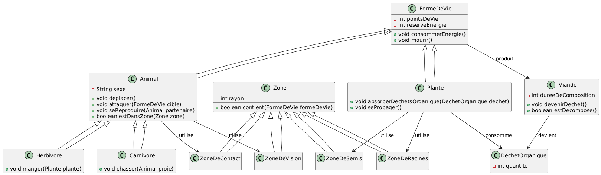
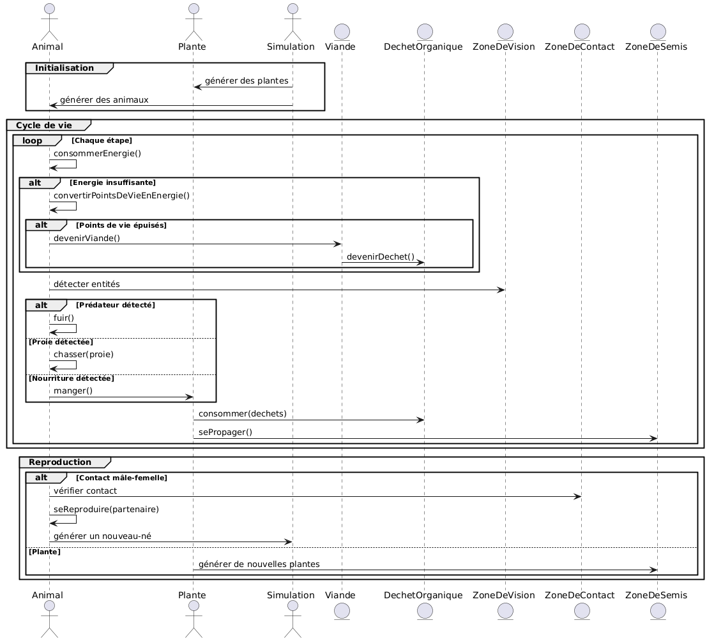
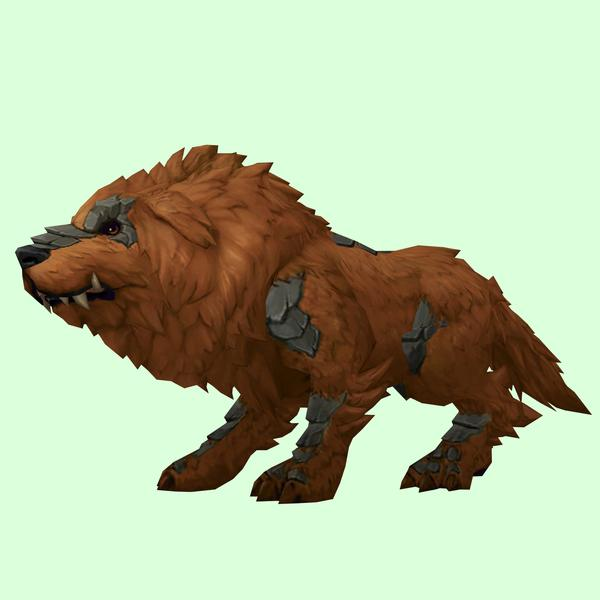
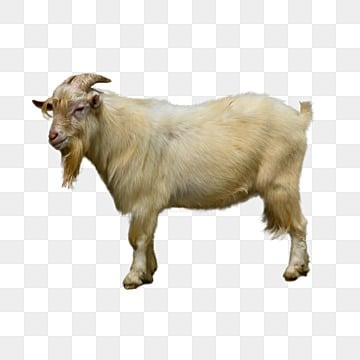
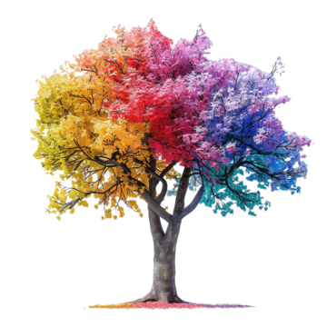
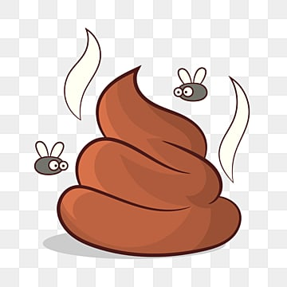
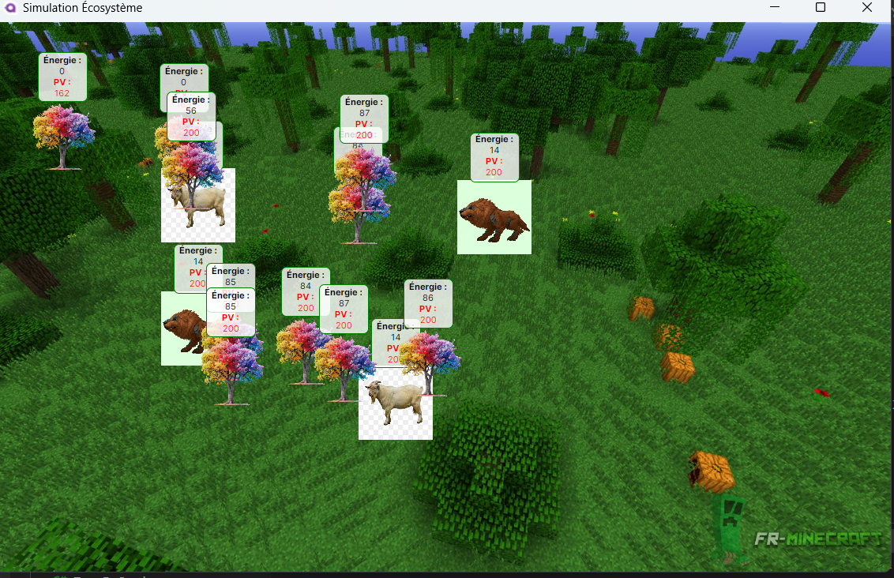
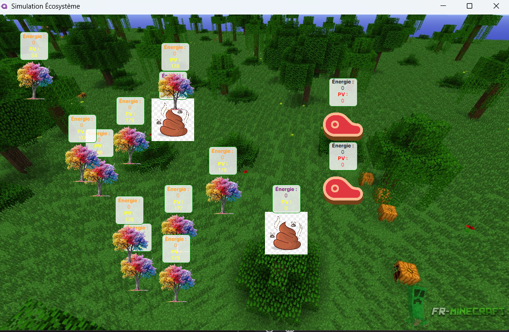

## Student
* YAYA LIBIS Issakha : 21252


# Rapport du projet : Simulateur d'écosystème

## Déscription Générale

Le projet consiste à créer un simulateur d'écosystème simplifié. Ce simulateur modélise un environnement 2D dans lequel des formes de vie interagissent selon des règles biologiques et écologiques. Les entités vivantes incluent des animaux (carnivores et herbivores), des plantes et des déchets organiques. Le projet met en œuvre des concepts tels que l'énergie, la reproduction, la consommation et les interactions entre entités.


## Structure du projet
Le simulateur est organisé autour de classes principales représentant les éléments de l'écosystème. Les diagrammes inclus fournissent une vue d'ensemble des relations entre ces classes.

## Diagrammes

* Diagramme de Classes : Vue d'ensemble de la structure, montrant l'héritage et les associations entre classes.

* Diagramme de Séquence : Illustrations des interactions entre entités lors d'une simulation.

## Class diagram
<p align="center">
		
</p>

## Sequence diagram
<p align="center">
	
</p>


## Détails des composants 

### Classe Animal

#### Description

Animal est une classe abstraite qui sert de base aux carnivores et herbivores. 

Cette abstraction respecte le principe OCP en permettant l'extension par l'ajout de nouveaux types d'animaux sans modifier la classe de base.
Elle respecte aussi le LSP : toutes les sous-classes (comme Carnivore et Herbivore) peuvent être utilisées de manière interchangeable avec Animal, garantissant que le comportement attendu reste cohérent.


#### Attributs

* Sexe : Indique le sexe pour la reproduction.

* Velocity : Vecteur représentant la direction et la vitesse de déplacement.

* Vision : Rayon de perception de l'animal.

* Speed : Vitesse de déplacement.

#### Méthodes Principales

* Deplacer() : Gère le déplacement.

* SawOpponent(FormeDeVie autre) : Détecte si une entité est dans le champ de vision.

* Mourir() : Gère la mort.

* Reproduction() : j'ai encore du mal à implémenter cela car la méthode change completement l'attente finale.


#### Sous-classes

* Carnivore :

<p align="center">

</p>

* Herbivore :

<p align="center">
	
</p>


L'ajout de nouvelles classes (par exemple, Omnivore) peut se faire sans modifier Animal tout en respectant son contrat comportemental.

### Classe Plante

#### Description

Représente les plantes qui se nourrissent de déchets organiques et se propagent dans leur environnement. Elle respecte l'OCP en permettant l'ajout de nouvelles fonctionnalités spécifiques (ex. plantes carnivores) via l'héritage. Le LSP est respecté en garantissant que toute plante spécialisée fonctionne comme une Plante classique dans les zones d'interaction ou de reproduction.

#### Attributs

* ZoneDeSemis : Zone où de nouvelles plantes peuvent apparaître.

* ZoneDeRacine : Zone pour l'absorption des nutriments.

* PointsDeVie : Indique la santé.

* ReserveEnergie : Détermine l'énergie disponible.

#### Méthodes Principales

* SePropager() : Gère la reproduction par défaut j'ai mis maximum 10 plantes.

* ConsommerEnergie() : Réduit l'énergie ou les points de vie si l'énergie est à 0.

* Mourir() : Transforme la plante en déchet organique.

* Plante
<p align="center">
	
</p>

#### Classe Zone

#### Description

Zone est une classe abstraite représentant une région circulaire autour d'une entité. Elle respecte l'OCP en permettant la création de nouvelles zones spécialisées sans modifier la base. Le LSP est également respecté, car toute zone spécifique (étendue de Zone) fonctionne de manière cohérente avec son interface de base.


#### Attributs

* Centre : Position centrale.

* Rayon : Rayon de la zone.

#### Méthodes Principales

* Contient(FormeDeVie formeDeVie) : Vérifie si une entité est dans la zone.

* Sous-classes

* ZoneDeContact : Détecte les contacts entre entités.

* ZoneDeVision : Gère la perception visuelle.

* ZoneDeSemis : Définit les zones de propagation des plantes.

* ZoneDeRacine : Gère l'absorption des nutriments.


#### Classe DechetOrganique

#### Description

Représente les déchets organiques produits par les plantes mortes ou les animaux. Cette classe respecte l'OCP car elle peut être étendue pour inclure d'autres types de déchets. Le LSP est assuré en garantissant que tout déchet spécialisé peut être traité comme un DechetOrganique standard.


#### Attributs

* TempsDeDecomposition : Temps avant la disparition du déchet.

* EstDecompose : Indique si le déchet est complètement décomposé.

* DéchetOrganique
<p align="center">
	
</p>


## Run
Au lancement du projet `Ecosystem`

## Cadre

<p align="center">
	
</p>

## Simulation description
Toutes les entités utilisées 


* Carnivore


* DéchetOrganique
<p align="center">
	
</p>

* Viande
<p align="center">
	
</p>


## Principes SOLID
### Single responsibility principle

Je prends l'exemple de la classe Plante qui hérite de FormeDeVie mais elle gère tout d'elle même.

```C#
using Avalonia;
using Avalonia.Media.Imaging;
using Avalonia.Platform;
using System;
using System.Collections.Generic;
using System.Linq;

namespace ECOSYS.ViewModels;

public partial class Plante : FormeDeVie
{
    private const int EnergiePourPropagation = 30; // Énergie nécessaire pour se propager
    private const int LimitePropagation = 10; // Maximum 10 plantes

    public int CompteurPropagation { get; private set; } = 0; // Compteur de propagations
    public ZoneDeSemis? ZoneDeSemis { get; set; }

    public Plante(Point location, ZoneDeSemis? zoneDeSemis = null) : base(location, null)
    {
        ZoneDeSemis = zoneDeSemis;

        var assetUri = new Uri("avares://ECOSYS/Assets/Plante.png");
        ImageSource = new Bitmap(AssetLoader.Open(assetUri));
    }

    public void SePropager(List<FormeDeVie> entites, int width, int height)
    {
        // Vérifie s'il y a déjà 10 plantes dans la simulation
        if (entites.OfType<Plante>().Count() >= 10)
        {
            return; // Ne propage pas si le nombre de plantes atteint la limite
        }

        if (ReserveEnergie < EnergiePourPropagation || CompteurPropagation >= LimitePropagation)
        {
            return; // Pas assez d'énergie ou limite atteinte
        }

        var random = new Random();
        int essais = 200; // Nombre maximal d'essais pour trouver une position libre

        while (essais > 0)
        {
            var nouvellePosition = new Point(
                Math.Clamp(Position.X + random.Next(0, 251), 10, width - 1), // Génère une position aléatoire plus éloignée
                Math.Clamp(Position.Y + random.Next(0, 251), 0, height - 1)
            );

            if (ZoneDeSemis != null && ZoneDeSemis.Contient(this) && ZoneDeSemis.EstPositionDisponible(nouvellePosition))
            {
                var nouvellePlante = new Plante(nouvellePosition, ZoneDeSemis)
                {
                    ImageSource = new Bitmap(AssetLoader.Open(new Uri("avares://ECOSYS/Assets/Plante.png")))
                };

                entites.Add(nouvellePlante);
                CompteurPropagation++;
                ReserveEnergie -= EnergiePourPropagation; // Réduit l'énergie après propagation
                break; 
            }

            essais--; // Réduit le nombre d'essais restants
        }
    }

    public override void Mourir()
    {
        ReserveEnergie = 0;
        PointsDeVie = 0;
        ImageSource = new Bitmap(AssetLoader.Open(new Uri("avares://ECOSYS/Assets/Déchet.png")));
    }
}
```

Ainsi la classe Herbivore qui hérite de la classe Animal qui lui aussi hérite de la classe FormeDeVie.

```C#
using System;
using Avalonia;
using Avalonia.Media.Imaging;
using Avalonia.Platform;
using CommunityToolkit.Mvvm.ComponentModel;

namespace ECOSYS.ViewModels;

public partial class Herbivore : Animal
{
    public Herbivore(Point location, string sexe = "M") : base(location, null, sexe)
    {
        ImageSource = new Bitmap(AssetLoader.Open(new Uri("avares://ECOSYS/Assets/Herbivore.png")));
    }

    public void Manger(Plante plante)
    {
        if (plante.EstVivant && SawOpponent(plante))
        {
            plante.Mourir();
            ReserveEnergie += 30; // Gain d'énergie après consommation de la plante
        }
    }

    public override void Mourir()
    {
        PointsDeVie = 0;
        ReserveEnergie = 0;
        ImageSource = new Bitmap(AssetLoader.Open(new Uri("avares://ECOSYS/Assets/Déchet.png")));
    }

    protected override Animal CreerDescendant(Point position)
    {
        var random = new Random();
        string sexeDescendant = random.Next(0, 2) == 0 ? "M" : "F";
        return new Herbivore(position, sexeDescendant);
    }
}

```

### Problème rencontrer lié à l'implémentaion

* Tout d'abord mon implémentation fonctionne mais elle ne réponds pas à toutes les critères demandées.

* Quand je lance la simulation sans les animaux, j'ai une les plantes qui se propagent et se transforment en Déchet quand ils n'ont plus des points de vie.

* Par contre dès que j'ajoute les animaux je vois mon implémentation bloquée s'ils n'ont plus de points de vie.

* j'ai essayé malheureusement j'ai encore du mal à résoudre ce problème.

<p align="center">
	
</p>


#### Conclusion

Ce projet fournit une simulation complète et modulable d'un écosystème. En appliquant les principes OCP et LSP, il garantit une extensibilité sans altérer les classes existantes et maintient des comportements cohérents pour toutes les entités, favorisant une structure claire et maintenable.
