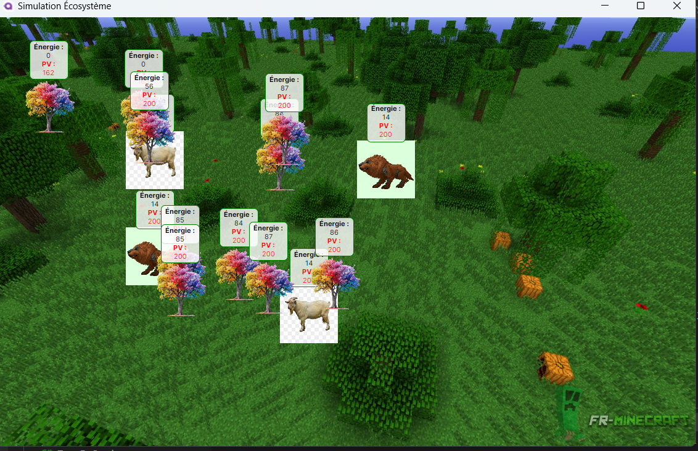

## Student
* YAYA LIBIS Issakha : 21252


# Rapport du projet : Simulateur d'écosystème

## Déscription Générale

Le projet consiste à créer un simulateur d'écosystème simplifié. Ce simulateur modélise un environnement 2D dans lequel des formes de vie interagissent selon des règles biologiques et écologiques. Les entités vivantes incluent des animaux (carnivores et herbivores), des plantes et des déchets organiques. Le projet met en œuvre des concepts tels que l'énergie, la reproduction, la consommation et les interactions entre entités.


## Structure du projet
Le simulateur est organisé autour de classes principales représentant les éléments de l'écosystème. Les diagrammes inclus fournissent une vue d'ensemble des relations entre ces classes.

## Diagrammes

    * Diagramme de Classes : Vue d'ensemble de la structure, montrant l'héritage et les associations entre classes.

    * Diagramme de Séquence : Illustrations des interactions entre entités lors d'une simulation.

## Détails des composants 

### Classe Animal

#### Description

Animal est une classe abstraite qui sert de base aux carnivores et herbivores.

#### Attributs

    * Sexe : Indique le sexe pour la reproduction.

    * Velocity : Vecteur représentant la direction et la vitesse de déplacement.

    * Vision : Rayon de perception de l'animal.

    * Speed : Vitesse de déplacement.

#### Méthodes Principales

    * Deplacer() : Gère le déplacement.

    * SawOpponent(FormeDeVie autre) : Détecte si une entité est dans le champ de vision.

    * Mourir() : Gère la mort.


#### Sous-classes

    * Carnivore :

        * Chasse les herbivores.

        * Gagne de l'énergie lorsqu'il tue une proie.

        * Peut se reproduire avec un partenaire.

    * Herbivore :

        * Mange des plantes.

        * Se reproduit avec un partenaire.

### Classe Plante

#### Description

Représente les plantes qui se nourrissent de déchets organiques et se propagent dans leur environnement.

#### Attributs

    * ZoneDeSemis : Zone où de nouvelles plantes peuvent apparaître.

    * ZoneDeRacine : Zone pour l'absorption des nutriments.

    * PointsDeVie : Indique la santé.

    * ReserveEnergie : Détermine l'énergie disponible.

#### Méthodes Principales

    * SePropager() : Gère la reproduction.

    * AbsorberNutriments() : Consomme les nutriments des déchets organiques.

    * ConsommerEnergie() : Réduit l'énergie ou les points de vie si l'énergie est à 0.

    * Mourir() : Transforme la plante en déchet organique.


#### Classe Zone

#### Description

Zone est une classe abstraite représentant une région circulaire autour d'une entité.

#### Attributs

    * Centre : Position centrale.

    * Rayon : Rayon de la zone.

#### Méthodes Principales

    * Contient(FormeDeVie formeDeVie) : Vérifie si une entité est dans la zone.

    * Sous-classes

    * ZoneDeContact : Détecte les contacts entre entités.

    * ZoneDeVision : Gère la perception visuelle.

    * ZoneDeSemis : Définit les zones de propagation des plantes.

    * ZoneDeRacine : Gère l'absorption des nutriments.


#### Classe DechetOrganique

#### Description

Représente les déchets organiques produits par les plantes mortes ou les animaux.

#### Attributs

    * TempsDeDecomposition : Temps avant la disparition du déchet.

    * EstDecompose : Indique si le déchet est complètement décomposé.

#### Méthodes Principales

    * SeDecomposer() : Réduit progressivement le temps de décomposition.

    * GenererDechet(FormeDeVie formeDeVie) : Crée un déchet organique à partir d'une entité morte.


#### Comportements et Interactions

    * Cycle de Vie : Chaque entité consomme de l'énergie, perd des points de vie si l'énergie est épuisée, et meurt lorsqu'elle n'a plus de points de vie.

    * Interactions :

        Les carnivores chassent les herbivores.

        Les herbivores mangent les plantes.

        Les plantes consomment les déchets organiques.

    * Reproduction :

        Les animaux se reproduisent par contact entre un mâle et une femelle.

        Les plantes se propagent dans leur zone de semis.


#### Conclusion

Ce projet fournit une simulation complète et modulable d'un écosystème. Il applique des principes de biologie et de programmation orientée objet, offrant une structure claire et extensible.


## Run
Launch the `Ecosystem` project to start the simulation.

## Framework
Our simulation is based on the Monogame framework in C#.

<p align="center">
	
</p>

## Simulation description
Every entities is represented by a sprite.
* Carnivorous: Groudon

<p align="center">
	
</p>

* Herbivorous: Herbizarre

<p align="center">

</p>

* Plants: SunPlant
<p align="center">
	
</p>

* OrganicWaste: Poop
<p align="center">
	
</p>

* Meat: Chicken leg
<p align="center">
	
</p>

## Class diagram
<p align="center">
	<a href="./Diagrams/ClassDiagram.pdf">
		
	</a>
</p>

## Sequence diagram
<p align="center">
	<a href="./Diagrams/SequenceDiagram.pdf">
		
	</a>
</p>

## SOLID principles
### Single responsibility principle
> A class should have one and only one reason to change, meaning that a class should only have one job.
>
> -- <cite>Robert C. Martin</cite>

As example the class Carnivore as only the job to set all the caracteristics at the carnivorous such as the damage they can do or the possibility to attack other animals.
```C#
public abstract class Carnivore : Animal
	{
		private float damage; // Damages per seconds

		protected Carnivore(AnimalSex sex, int visionZoneRadius, int contactZoneRadius, float speed, float damage) : 
			base(sex, visionZoneRadius, contactZoneRadius, speed)
		{
			this.damage = damage;
		}

		public float Damage
		{
			get { return damage; }
		}

		// TODO: Implement the Eat method when the Meat is created
		public override void Eat(IEatable food)
		{
			if (CanEat(food))
			{
				Energy += food.EatingEnergy;
				Hunger -= food.SatiationPoint;
			}
		}

		public override bool CanEat(IEatable food)
		{
			return (food is Meat);
		}

		public void Attack(Animal prey)
		{
			if (CanAttack(prey))
				prey.Health -= damage;
		}

		public bool CanAttack(Animal prey)
		{
			return (prey is Herbivore);
		}
    }
```

### Liskov substitution principle
>Let q(x) be a property provable about objects of x of type T.
Then q(y) should be provable for objects y of type S
where S is a subtype of T.
>
> -- <cite>Barbara Liskov and Jeannette Wing</cite>

Animal can be replaced by every of its subclass (Carnivore, Herbivore, ...).

As example the method EatAnimal is using this principle by using an `Animal` object as `Carnivore`. 
```C#
	void EatAnimal(List<Entity> visionList, Animal lifeForm)
	{
		if (lifeForm.IsHungry() == false)
			return;

		List<Entity> eatableInVision = new List<Entity>(visionList.FindAll(delegate (Entity visionLife) { return lifeForm.CanEat(visionLife as IEatable); }));
		List<Entity> eatableInContact = new List<Entity>(eatableInVision.FindAll(lifeForm.IsInContactZone));

		if (eatableInContact.Count != 0)
			Eat(lifeForm, eatableInContact[0] as IEatable);
		else if (eatableInVision.Count != 0)
		{
			lifeForm.DestinationX = eatableInVision[0].Sprite.PositionX;
			lifeForm.DestinationY = eatableInVision[0].Sprite.PositionY;
		}
		else if (lifeForm is Carnivore)
			Attack(lifeForm as Carnivore, visionList);
	}
```


